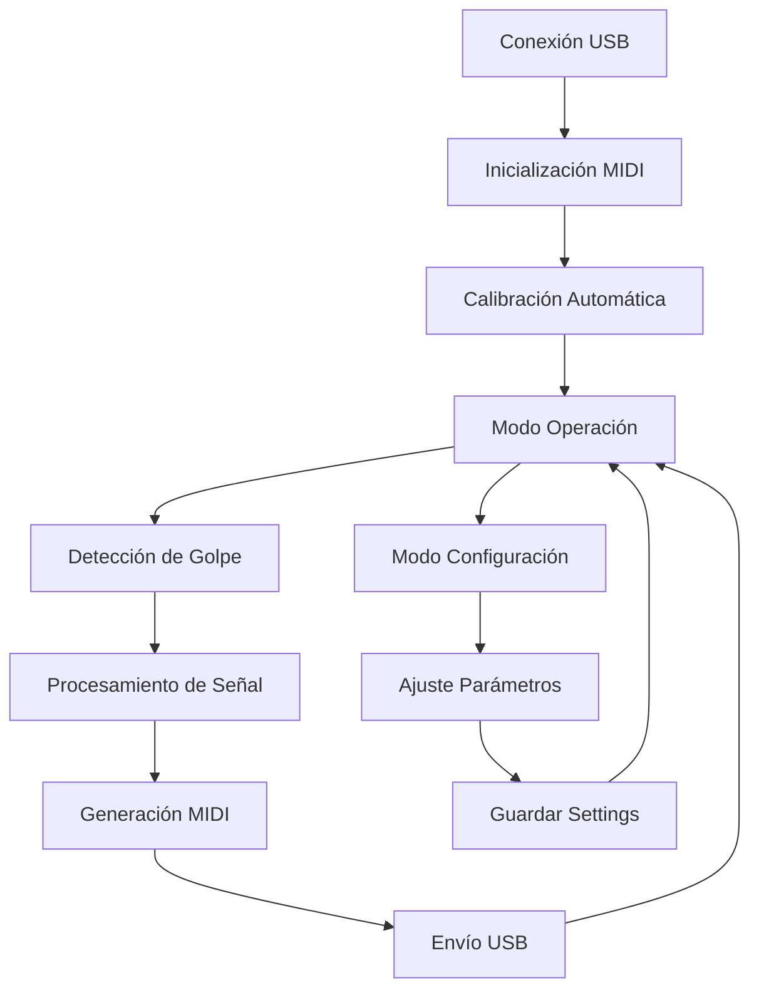

# ESP32 E-Drum Trigger - Requerimientos del Producto

## 1. Descripción General del Producto

Sistema de trigger electrónico para batería basado en ESP32-S3 que detecta golpes en pads piezoeléctricos y envía mensajes MIDI via USB. Port del proyecto open-source Edrumulus desde Arduino/PlatformIO a ESP-IDF nativo.

El sistema permite detectar diferentes tipos de golpes (rimshots, positional sensing) y cancela crosstalk entre pads, proporcionando una experiencia de batería electrónica de alta calidad con latencia < 10ms. El ESP32-S3 proporciona soporte nativo para USB OTG, esencial para la comunicación MIDI directa.

## 2. Características Principales

### 2.1 Roles de Usuario

| Rol | Método de Acceso | Permisos Principales |
|-----|------------------|----------------------|
| Músico/Baterista | Conexión USB directa | Usar el pad, ajustar sensibilidad básica |
| Técnico/Configurador | Interfaz de configuración | Calibrar parámetros avanzados, configurar MIDI |

### 2.2 Módulos de Funcionalidad

Nuestro sistema de e-drum consta de las siguientes páginas/interfaces principales:

1. **Interfaz USB MIDI**: Comunicación MIDI estándar, detección automática por DAW
2. **Sistema de Detección**: Algoritmos de procesamiento de señal, filtrado y detección de picos
3. **Configuración de Pads**: Calibración de sensibilidad, umbrales y tipos de pad
4. **Monitor de Estado**: Indicadores LED, diagnóstico de señales

### 2.3 Detalles de Módulos

| Módulo | Componente | Descripción de Funcionalidad |
|--------|------------|-------------------------------|
| Interfaz USB MIDI | Driver TinyUSB | Configurar dispositivo MIDI USB, enviar note on/off, velocity, aftertouch |
| Interfaz USB MIDI | Gestión de Mensajes | Formatear mensajes MIDI estándar, manejar canales múltiples |
| Sistema de Detección | ADC Sampling | Muestrear señales piezoeléctricas a 8kHz, filtrar ruido, compensar DC offset |
| Sistema de Detección | Detección de Picos | Identificar golpes válidos, calcular velocity, detectar rimshots |
| Sistema de Detección | Positional Sensing | Calcular posición del golpe usando múltiples sensores, generar MIDI CC |
| Sistema de Detección | Crosstalk Cancellation | Cancelar interferencia entre pads cercanos, evitar triggers falsos |
| Configuración de Pads | Calibración | Ajustar umbrales de velocity, sensibilidad, tiempo de máscara |
| Configuración de Pads | Tipos de Pad | Configurar presets para diferentes tipos (snare, tom, cymbal, hi-hat) |
| Monitor de Estado | LED RGB Integrado | Indicar estado de conexión, overload, errores de calibración usando el LED direccionable de la placa |
| Monitor de Estado | Diagnóstico | Monitorear niveles de señal, detectar problemas de hardware |

## 3. Proceso Principal

### Flujo de Operación del Músico
1. Conectar el pad ESP32 via USB al ordenador/DAW
2. El sistema se detecta automáticamente como dispositivo MIDI
3. Tocar el pad genera mensajes MIDI Note On/Off con velocity
4. Los rimshots y golpes posicionales envían datos adicionales via MIDI CC
5. El DAW/software recibe y procesa los mensajes MIDI normalmente

### Flujo de Configuración del Técnico
1. Acceder a modo de configuración (botón/secuencia especial)
2. Calibrar umbrales de detección para cada tipo de golpe
3. Ajustar parámetros de crosstalk y positional sensing
4. Guardar configuración en memoria no volátil
5. Validar funcionamiento con golpes de prueba

## 4. Diseño de Interfaz de Usuario

### 4.1 Estilo de Diseño

- **Colores primarios**: Verde (#00FF00) para estado OK, Rojo (#FF0000) para errores, Azul (#0000FF) para configuración
- **Estilo de indicadores**: LED RGB direccionable integrado en la placa, colores sólidos y patrones de parpadeo para estados
- **Interfaz física**: Rotary encoder con pulsador integrado, botón de boot de la placa de desarrollo (solo dos botones)
- **Estilo de respuesta**: Feedback táctil inmediato, latencia visual < 50ms
- **Iconografía**: Símbolos estándar MIDI, indicadores de nivel tipo VU-meter

### 4.2 Descripción de Interfaces

| Módulo | Componente | Elementos de UI |
|--------|------------|------------------|
| Monitor de Estado | LED RGB Integrado | Verde sólido: funcionando, Verde parpadeante: configuración, Rojo: error, Azul: modo MIDI, Blanco parpadeante: detección de golpe, Amarillo: overload |
| Configuración | Rotary Encoder | Rotación: ajuste de sensibilidad general en tiempo real, rango 0-127; Pulsación: confirmar selección |
| Configuración | Botón Boot | Pulsación durante encendido: acceso a modo configuración, reset de fábrica |

### 4.3 Responsividad

Dispositivo embebido con interfaz física mínima. Respuesta en tiempo real crítica para aplicaciones musicales. Optimizado para latencia ultra-baja y operación standalone sin dependencias externas.