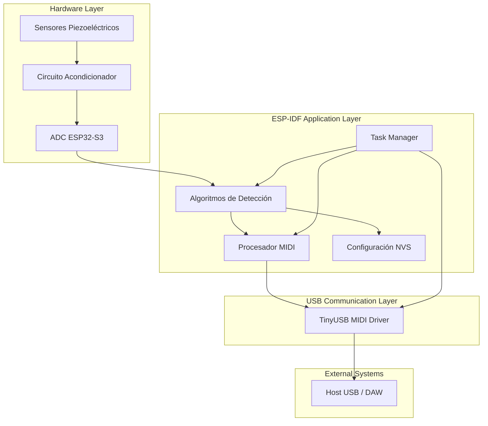
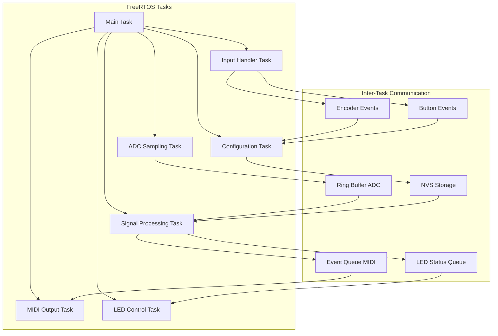
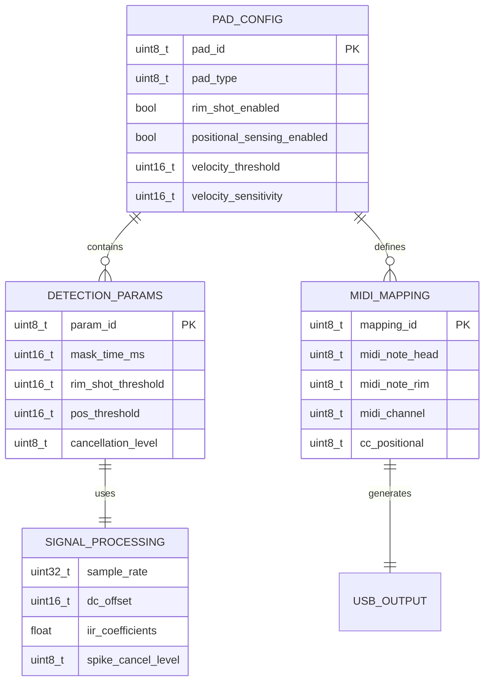

# ESP32 E-Drum Trigger - Arquitectura Técnica

## 1. Diseño de Arquitectura



## 2. Descripción de Tecnologías

* **Hardware**: ESP32-S3 (Xtensa LX7 dual-core, 240MHz, WiFi/BLE, USB OTG nativo)

* **Framework**: ESP-IDF v5.1+ (FreeRTOS, componentes nativos)

* **USB Stack**: esp\_tinyusb v1.7.6+ (soporte MIDI nativo)

* **Almacenamiento**: NVS (Non-Volatile Storage) para configuración

* **Procesamiento**: Algoritmos portados desde Edrumulus (C++)

* **Interfaz Usuario**: LED RGB direccionable + encoder rotativo + botón boot

* **Drivers GPIO**: led\_strip (WS2812), rotary\_encoder, button debounce

## 3. Definiciones de Rutas

Sistema embebido sin rutas web tradicionales. Interfaces de comunicación:

| Interfaz     | Propósito                           |
| ------------ | ----------------------------------- |
| USB MIDI     | Comunicación principal con DAW/host |
| UART Debug   | Logs de desarrollo y diagnóstico    |
| GPIO Config  | Botón boot + encoder rotativo       |
| ADC Channels | Entrada de sensores piezoeléctricos |
| RGB LED      | Indicación visual de estado         |

## 4. Definiciones de API

### 4.1 API Principal del Sistema

#### Inicialización del Sistema

```c
esp_err_t edrumulus_init(edrumulus_config_t* config)
```

Parámetros:

| Nombre | Tipo                   | Requerido | Descripción                       |
| ------ | ---------------------- | --------- | --------------------------------- |
| config | edrumulus\_config\_t\* | true      | Configuración inicial del sistema |

Respuesta:

| Nombre | Tipo        | Descripción                                |
| ------ | ----------- | ------------------------------------------ |
| return | esp\_err\_t | ESP\_OK si éxito, código de error si falla |

Ejemplo:

```c
edrumulus_config_t config = {
    .num_pads = 1,
    .sample_rate = 8000,
    .adc_channels = {ADC1_CHANNEL_0},
    .midi_channel = 10
};
esp_err_t ret = edrumulus_init(&config);
```

#### Procesamiento de Muestra

```c
esp_err_t edrumulus_process_sample(uint16_t* adc_values, size_t num_channels)
```

Parámetros:

| Nombre        | Tipo        | Requerido | Descripción                  |
| ------------- | ----------- | --------- | ---------------------------- |
| adc\_values   | uint16\_t\* | true      | Array de valores ADC crudos  |
| num\_channels | size\_t     | true      | Número de canales a procesar |

#### Configuración de Pad

```c
esp_err_t edrumulus_set_pad_config(uint8_t pad_id, pad_config_t* config)
```

Parámetros:

| Nombre  | Tipo             | Requerido | Descripción                      |
| ------- | ---------------- | --------- | -------------------------------- |
| pad\_id | uint8\_t         | true      | ID del pad (0-15)                |
| config  | pad\_config\_t\* | true      | Configuración específica del pad |

### 4.2 API de Control de Hardware

#### Control de LED RGB

```c
esp_err_t edrumulus_led_set_color(uint8_t red, uint8_t green, uint8_t blue)
esp_err_t edrumulus_led_set_pattern(led_pattern_t pattern)
esp_err_t edrumulus_led_set_brightness(uint8_t brightness)
```

Patrones de LED:

| Patrón                    | Descripción     |
| ------------------------- | --------------- |
| LED\_PATTERN\_SOLID       | Color sólido    |
| LED\_PATTERN\_BLINK       | Parpadeo lento  |
| LED\_PATTERN\_FAST\_BLINK | Parpadeo rápido |
| LED\_PATTERN\_PULSE       | Pulsación suave |
| LED\_PATTERN\_OFF         | LED apagado     |

#### Control de Encoder Rotativo

```c
esp_err_t edrumulus_encoder_init(gpio_num_t pin_a, gpio_num_t pin_b, gpio_num_t pin_btn)
int32_t edrumulus_encoder_get_value(void)
bool edrumulus_encoder_button_pressed(void)
esp_err_t edrumulus_encoder_reset_value(void)
```

#### Control de Botón Boot

```c
bool edrumulus_boot_button_pressed(void)
uint32_t edrumulus_boot_button_hold_time(void)
```

### 4.3 API de Eventos MIDI

#### Callback de Evento MIDI

```c
typedef void (*midi_event_callback_t)(midi_event_t* event)
```

Estructura de Evento:

```c
typedef struct {
    uint8_t type;        // NOTE_ON, NOTE_OFF, CONTROL_CHANGE
    uint8_t channel;     // Canal MIDI (0-15)
    uint8_t note;        // Nota MIDI (0-127)
    uint8_t velocity;    // Velocity (0-127)
    uint8_t cc_number;   // Número de Control Change (para positional sensing)
    uint8_t cc_value;    // Valor de Control Change
} midi_event_t;
```

## 5. Arquitectura del Servidor



## 6. Modelo de Datos

### 6.1 Definición del Modelo de Datos



### 6.2 Definición de Estructuras de Datos

#### Configuración Principal del Sistema

```c
// Estructura principal de configuración
typedef struct {
    uint8_t num_pads;                    // Número de pads configurados (1-4)
    uint32_t sample_rate;                // Frecuencia de muestreo (8000 Hz)
    adc1_channel_t adc_channels[MAX_PADS]; // Canales ADC asignados
    uint8_t midi_channel;                // Canal MIDI base (0-15)
    bool usb_midi_enabled;               // Habilitar salida USB MIDI
    uint8_t spike_cancel_level;          // Nivel de cancelación de spikes (0-10)
    
    // Configuración de hardware de interfaz
    gpio_num_t led_pin;                 // Pin del LED RGB direccionable
    gpio_num_t encoder_pin_a;           // Pin A del encoder rotativo
    gpio_num_t encoder_pin_b;           // Pin B del encoder rotativo
    gpio_num_t encoder_btn_pin;         // Pin del botón del encoder
    gpio_num_t boot_btn_pin;            // Pin del botón boot (GPIO0)
    uint8_t led_brightness;             // Brillo del LED (0-255)
} edrumulus_config_t;

// Configuración específica de pad
typedef struct {
    pad_type_t type;                     // Tipo de pad (SNARE, TOM, CYMBAL, etc.)
    uint16_t velocity_threshold;         // Umbral mínimo de velocity (0-4095)
    uint16_t velocity_sensitivity;       // Sensibilidad de velocity (1-100)
    uint16_t mask_time_ms;              // Tiempo de máscara anti-rebote (1-100ms)
    bool rim_shot_enabled;              // Habilitar detección de rimshot
    uint16_t rim_shot_threshold;        // Umbral para rimshot (0-4095)
    bool positional_sensing_enabled;    // Habilitar positional sensing
    uint16_t pos_threshold;             // Umbral para positional sensing
    uint8_t midi_note_head;             // Nota MIDI para golpe central
    uint8_t midi_note_rim;              // Nota MIDI para rimshot
    uint8_t cc_positional;              // CC para positional sensing
    uint8_t cancellation_level;         // Nivel de crosstalk cancellation
} pad_config_t;

// Estados de detección en tiempo real
typedef struct {
    float current_sample;               // Muestra actual procesada
    float dc_offset;                   // Offset DC estimado
    bool peak_detected;                // Pico detectado en esta iteración
    uint8_t velocity;                  // Velocity calculado (0-127)
    uint8_t position;                  // Posición calculada (0-127)
    rim_state_t rim_state;             // Estado del rim (NONE, SHOT, ONLY)
    uint32_t last_trigger_time;        // Timestamp del último trigger
    bool is_masked;                    // Pad en período de máscara
} pad_state_t;

// Estados del LED RGB
typedef enum {
    LED_PATTERN_SOLID,                 // Color sólido
    LED_PATTERN_BLINK,                 // Parpadeo lento (1Hz)
    LED_PATTERN_FAST_BLINK,            // Parpadeo rápido (5Hz)
    LED_PATTERN_PULSE,                 // Pulsación suave
    LED_PATTERN_OFF                    // LED apagado
} led_pattern_t;

typedef struct {
    uint8_t red;                       // Componente rojo (0-255)
    uint8_t green;                     // Componente verde (0-255)
    uint8_t blue;                      // Componente azul (0-255)
    led_pattern_t pattern;             // Patrón de animación
    uint8_t brightness;                // Brillo global (0-255)
    bool enabled;                      // LED habilitado
} led_state_t;

// Eventos de entrada del usuario
typedef enum {
    INPUT_EVENT_ENCODER_CW,            // Encoder girado en sentido horario
    INPUT_EVENT_ENCODER_CCW,           // Encoder girado en sentido antihorario
    INPUT_EVENT_ENCODER_BTN_PRESS,     // Botón encoder presionado
    INPUT_EVENT_ENCODER_BTN_RELEASE,   // Botón encoder liberado
    INPUT_EVENT_BOOT_BTN_PRESS,        // Botón boot presionado
    INPUT_EVENT_BOOT_BTN_RELEASE,      // Botón boot liberado
    INPUT_EVENT_BOOT_BTN_LONG_PRESS    // Botón boot presionado >3 segundos
} input_event_type_t;

typedef struct {
    input_event_type_t type;           // Tipo de evento
    uint32_t timestamp;                // Timestamp del evento
    int32_t encoder_value;             // Valor actual del encoder
    uint32_t hold_duration;            // Duración de presión (para botones)
} input_event_t;
```

#### Inicialización de Datos por Defecto

```c
// Configuración por defecto del sistema
static const edrumulus_config_t default_config = {
    .num_pads = 1,
    .sample_rate = 8000,
    .adc_channels = {ADC1_CHANNEL_0},
    .midi_channel = 10,
    .usb_midi_enabled = true,
    .spike_cancel_level = 5,
    
    // Configuración de hardware por defecto para ESP32-S3
    .led_pin = GPIO_NUM_48,             // LED RGB integrado (WS2812)
    .encoder_pin_a = GPIO_NUM_1,        // Encoder A
    .encoder_pin_b = GPIO_NUM_2,        // Encoder B
    .encoder_btn_pin = GPIO_NUM_3,      // Botón encoder
    .boot_btn_pin = GPIO_NUM_0,         // Botón boot
    .led_brightness = 128               // Brillo medio
};

// Configuración por defecto de pad tipo snare
static const pad_config_t default_snare_config = {
    .type = PAD_TYPE_SNARE,
    .velocity_threshold = 100,
    .velocity_sensitivity = 50,
    .mask_time_ms = 20,
    .rim_shot_enabled = true,
    .rim_shot_threshold = 200,
    .positional_sensing_enabled = false,
    .pos_threshold = 150,
    .midi_note_head = 38,  // Snare drum
    .midi_note_rim = 40,   // Snare rim
    .cc_positional = 16,
    .cancellation_level = 3
};
```

