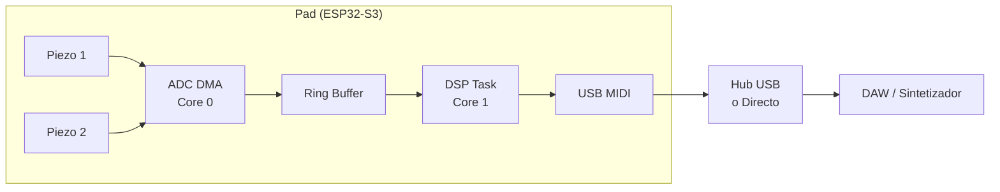

# Arquitectura de Pad de Batería Electrónica con Positional Sensing

## 1. Resumen del Proyecto

Implementación de un pad de batería electrónico con *positional sensing* (detección de posición de golpe) basado en **ESP32-S3**. El sistema utiliza dos sensores piezoeléctricos por pad para inferir la posición del impacto mediante algoritmos híbridos de **TDOA** (Time Difference of Arrival) y relación de amplitudes. La latencia total objetivo es de **< 5 ms**.

### Features implementados
- ✅ ADC continuo con DMA (8kHz por canal, 2 canales)
- ✅ Arquitectura dual-core (Core 0 = DMA, Core 1 = DSP)
- ✅ Filtro pasa-banda IIR 40-400 Hz
- ✅ Detección avanzada de rebotes (Phase 3)
- ✅ Positional sensing híbrido: TDOA + Amplitude Ratio
- ✅ USB MIDI nativo con Note On/Off + CC para posición
- ✅ Consola serial para ajuste de parámetros en tiempo real
- ✅ LED RGB de estado
- ✅ Encoder rotatorio + botones de entrada
- ✅ Configuración persistente en NVS

---

## 2. Arquitectura del Sistema

### 2.1. Topología

Cada pad es una unidad independiente con su propio ESP32-S3, conectado vía USB a un hub o directamente al host.



### 2.2. Distribución Dual-Core

| Core | Tarea | Prioridad | Descripción |
|------|-------|-----------|-------------|
| **Core 0** | ADC DMA ISR | — (IRAM) | Llena ring buffer con muestras de 2 canales |
| **Core 0** | `synthtest` (opcional) | 4 | Generador sintético: reemplaza al ADC como productor del ring buffer |
| **Core 1** | `dsp_task` | Alta (5) | Consume ring buffer, ejecuta pipeline de detección |
| **Cualquiera** | `main loop` | Normal (1) | Recibe eventos de cola, envía MIDI + LED |
| **Automático** | TinyUSB | Media | Stack USB manejado por esp_tinyusb |

### 2.3. Modo Test Sintético

Valida el pipeline completo sin hardware: un generador de bursts senoidales
amortiguados (`edrumulus_synthtest`) inyecta muestras al ring buffer
bypaseando el ADC. Al activarlo se **detiene el ADC real** para mantener la
regla de productor único; al desactivarlo se restaura.

- Posición → delay inter-piezo (`Δt = ((pos−63.5)/63.5)·3000 µs`), valida el TDOA con timestamps por muestra
- Velocity → amplitud (`A = 2·vel/127`)
- Control por consola: `test hit/auto/stop/mode/status` + `set synth_*`
- Runbook completo y hallazgos: **[docs/TESTING-SYNTHETIC.md](docs/TESTING-SYNTHETIC.md)**

---

## 3. Pipeline de Procesamiento

```
ADC DMA (Core 0)
    │  muestras raw 12-bit @ 8kHz/ch
    ▼
Ring Buffer (lock-free, 512 entries)
    │
    ▼
dsp_task (Core 1)
    │
    ├── 1. Normalizar (raw 0-4095 → float 0.0-1.0)
    ├── 2. Filtro pasa-banda IIR 40-400 Hz
    ├── 3. Detector de rebotes (Phase 3)
    │       ├── Edge detector (rise/fall rate)
    │       ├── Decay analyzer (R² exponencial)
    │       ├── Velocity validator (consistencia)
    │       └── Adaptive threshold (SNR)
    ├── 4. Positional Sensing
    │       ├── TDOA: Δt entre picos de ambos piezos
    │       ├── Amplitude Ratio: comparación de magnitudes
    │       └── Híbrido: TDOA 70% + Amp 30%
    └── 5. Encolar hit_event_t
            │
            ▼
    Main Loop
        ├── Note On (MIDI)
        ├── CC position (MIDI CC 16)
        └── Note Off (MIDI, tras 30ms)
```

---

## 4. Hardware

### 4.1. Microcontrolador
- **ESP32-S3** (Dual-core Xtensa LX7 @ 240MHz)
- Native USB OTG (GPIO19 D-, GPIO20 D+)
- SPIRAM 16MB (OCT, 80MHz)

### 4.2. Pines

| Señal | GPIO | Descripción |
|-------|------|-------------|
| Piezo 1 (ADC) | GPIO4 | ADC1_CH4, sensor primario |
| Piezo 2 (ADC) | GPIO5 | ADC1_CH5, sensor secundario |
| LED RGB | GPIO21.*WS2812 addressable |
| Encoder A | GPIO1 | Rotación |
| Encoder B | GPIO2 | Rotación |
| Encoder Botón | GPIO3 | Pulsador |
| Boot Button | GPIO0 | System (active low) |
| USB D- | GPIO19 | Native USB (fijo) |
| USB D+ | GPIO20 | Native USB (fijo) |

### 4.3. Frontend Analógico
Por cada piezo:
- **Bias**: Divisor resistivo a 1.65V (midpoint de 3.3V) para capturar señal AC completa
- **Anti-aliasing**: Filtro RC pasabajo (10kΩ + 100nF) antes del pin ADC
- **Desacoplo**: Capacitor 100nF en entrada ADC

---

## 5. Positional Sensing

### 5.1. TDOA (Time Difference of Arrival)

Mide el retardo entre la detección del pico en el Piezo 1 vs el Piezo 2:

```
posición_TDOA = Δt / MAX_DELTA_US
Δt ∈ [-3000µs, +3000µs] → posición ∈ [0, 127]
     Δt > 0 → golpe más cerca de piezo 1
     Δt < 0 → golpe más cerca de piezo 2
     Δt ≈ 0 → golpe en el centro (posición 64)
```

### 5.2. Amplitude Ratio

Compara el voltaje pico de ambos sensores como fallback:

```
posición_amp = amp_piezo2 / (amp_piezo1 + amp_piezo2)
→ posición ∈ [0, 127] (0 = todo piezo1, 127 = todo piezo2)
```

### 5.3. Algoritmo Híbrido

| Condición | TDOA | Amplitude |
|-----------|------|-----------|
| Δt ≥ 50µs (válido) | 70% | 30% |
| Δt < 50µs (centro) | 0% | 100% |

Se aplica un filtro EMA (α = 0.35) para suavizar la posición entre golpes.

---

## 6. MIDI Mapping

| Tipo | Canal | Dato | Descripción |
|------|-------|------|-------------|
| Note On | 10 (0-indexed: 9) | note, velocity | Golpe detectado |
| CC | 10 | CC 16, value | Posición (0-127) |
| Note Off | 10 | note, 0 | Liberación (30ms después) |

---

## 7. Stack de Software

| Componente | Propósito |
|------------|-----------|
| **ESP-IDF v5.5.1** | Framework |
| **FreeRTOS** | Scheduling, tareas, colas |
| **esp_tinyusb** | USB MIDI Class-Compliant |
| **adc_continuous** | ADC con DMA, 8kHz, 2 canales |
| **edrumulus_detection** | Pipeline DSP (filter, rebound, TDOA) |
| **edrumulus_midi** | MIDI output (Note, CC) |
| **edrumulus_console** | Comando serial en tiempo real |
| **edrumulus_config** | Persistencia en NVS |
| **edrumulus_led** | LED RGB WS2812 |
| **edrumulus_input** | Encoder + botones |

---

## 8. Presupuesto de Latencia (Objetivo)

| Etapa | Latencia | Notas |
|-------|----------|-------|
| DMA ADC + ring buffer | ~125µs | 8kHz → 125µs/muestra |
| Filtro + detección | ~1-2ms | Ventana de análisis |
| Antirrebote (mask time) | ~2-5ms | Adaptativo según velocidad |
| Formateo + USB | ~1ms | 1 frame USB Full-Speed |
| **Total** | **~3-5ms** | Óptimo para percusión |

---

## 9. Comandos de Consola

```
help                           → Lista de comandos
show                           → Configuración actual
set <param> <value>            → Ajustar parámetro
test <module>                  → Prueba de módulo (edge, decay, velocity, adaptive, all)
save/load [name]               → Persistir/cargar config
reset                          → Valores de fábrica
```

### Test sintético (sin hardware)

```
test hit [vel] [pos]           → Golpe sintético on-demand (def: 100, 64)
test auto [interval_ms]        → Golpes periódicos (def: 500 ms)
test stop                      → Detiene el test y restaura el ADC
test mode [on|off]             → Activa/desactiva el modo sintético
test status                    → Estado del generador
set synth_freq <hz>            → Frecuencia del burst (def: 340)
set synth_decay <ms>           → Decay exponencial (def: 120)
set synth_rise <ms>            → Ataque (def: 1.0)
set synth_dur <ms>             → Duración total (def: 250)
```

### Parámetros ajustables
- `edge_threshold`, `edge_sensitivity`
- `tau_min`, `tau_max`, `r_squared`
- `linearity`, `min_velocity`
- `snr_target`, `adaptation_time`
- `synth_freq`, `synth_decay`, `synth_rise`, `synth_dur`
- Parámetros TDOA (próximamente)

---

## 10. Roadmap

- [x] **Fase 1**: ADC continuo con DMA (8kHz, 2 canales) — PR #12
- [x] **Fase 2**: Dual-core pinning (Core 0=ADC, Core 1=DSP) — PR #13
- [x] **Fase 3**: Detección avanzada (rebotes, edge, decay) — PR #14
- [x] **Fase 4**: Positional sensing TDOA + Amp Ratio — PR #15
- [x] **Fase 5**: MIDI CC para posición — PR #16
- [ ] **Fase 6**: Optimizar latencia < 5ms + HITL validation
- [ ] **Fase 7**: Calibración ADC + frontend analógico
- [ ] **Fase 8**: Diseño PCB y montaje físico

---

*Documento generado a partir de la spec técnica original y el código implementado.*
